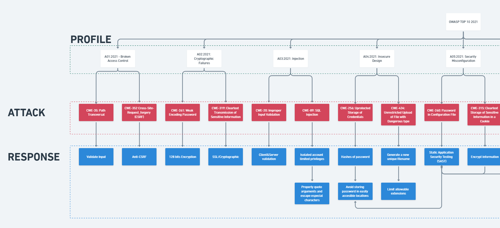

# AppsecPwn
Application in the firmware:
- Wifi
  - Deauth:
  - Broadcast: Send broadcast packets to the selected AP.
  - Rogue AP: Clone the selected AP.
  - Combine: Create a clone of the selected AP and send broadcast packets to the real AP.
  - Multi-AP: Create APs for all the scanned networks.
  - Captive portal:
    - Google: Request credentials from the user.
    - WIFI Pass: Steal the WiFi password by asking the user to enter their network password.
- BLE
  - Trackers: Scanner for Airtags and Tile devices.
  - Spam: Send ADV packets to connect devices to an Apple device.
  - Game: Game based on OWASP vulnerabilities.
- Zigbee
  - Sniffer: IEEE 802.15.4 Sniffer, requires a computer serial connection.
- Settings
  - Display: Change the logo screen. If the bonus logos are unlocked, this option allows you to change the logo.

## Game
When entering pairing mode, the game must have a Blue team player and a Red team player. The devices need to be close to each other to start the game. Once started, the Red team player selects the OWASP profile to use and then the attack. When the attack is sent, the Blue team player receives it and must select a mitigation measure. If the mitigation is successful, the Blue team wins the round and the Red team loses points. The game ends when either team loses all their points.

### Unlocks
To unlock the logos, the player must win 10 games using the 10 OWASP profiles. Every 3 profiles unlock a new level until the highest level is reached.
Levels:
Jedi:
Level 1: Padawan
Level 2: Knight
Level 3: Master
Level 4: Grand Master <- Highest Level
Sith:
Level 1: Lord
Level 2: Master
Level 3: Darth
Level 4: Dark Lord <- Highest level

It is not required to unlock the backgrounds in a specific order; the condition is to win games with different profiles. To unlock faster, it is convenient to win each game using different attacks. Each game saves which profile was used; if you win with those profiles, an internal flag is set which allows you to level up.

### Profile map

#### Part 1

#### Part 2

### Logos
#### Sith Logo

#### Jedi Logo

